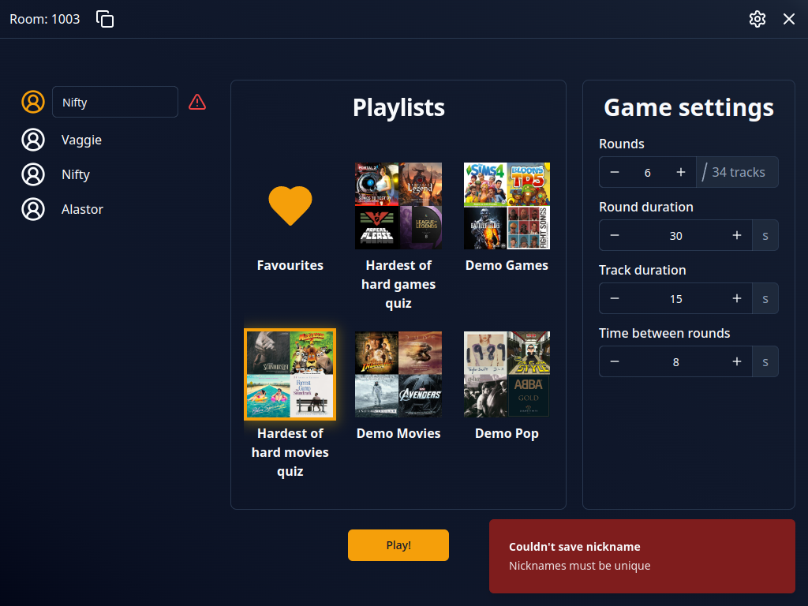
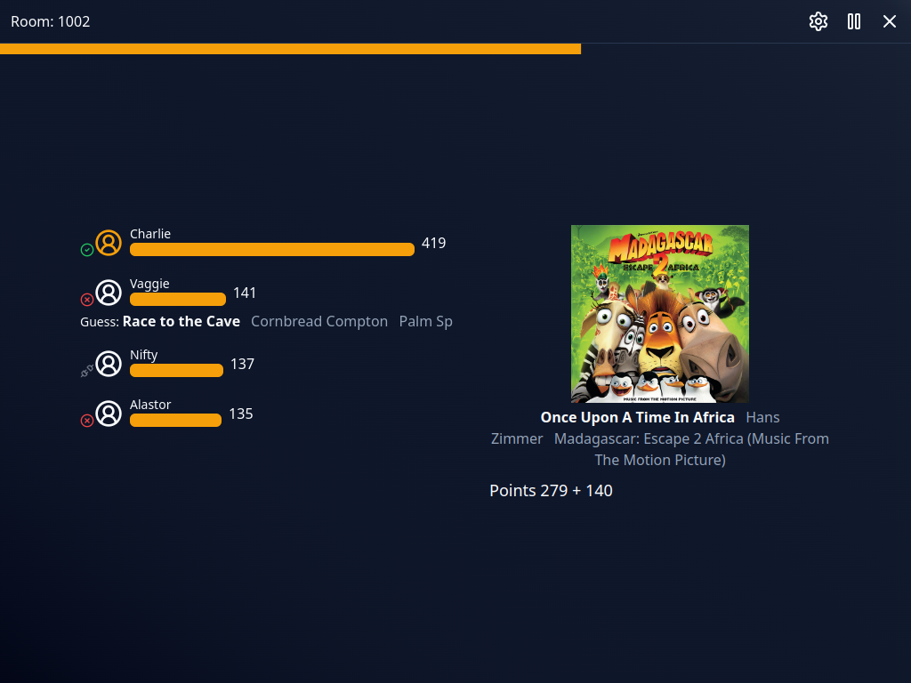
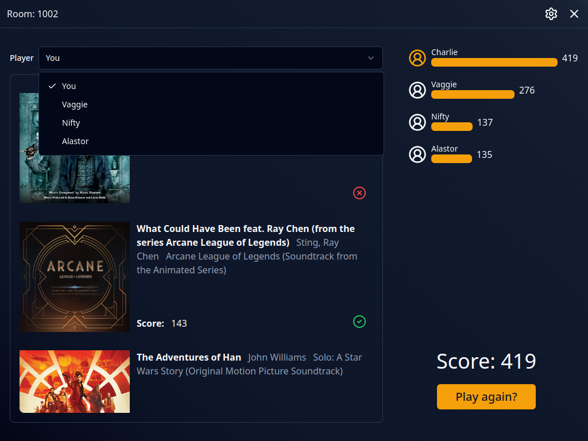
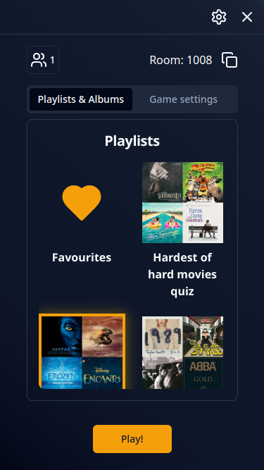
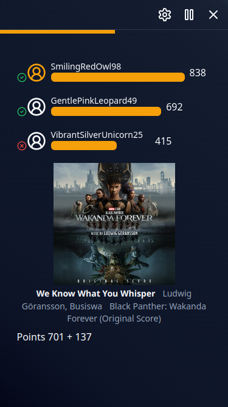
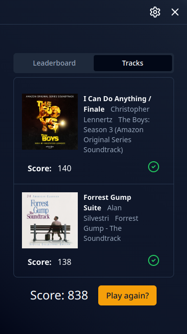
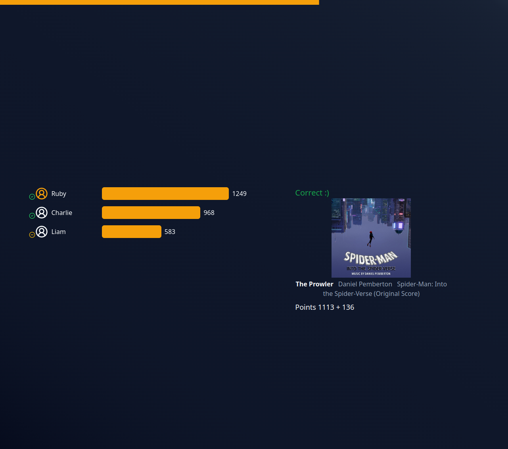
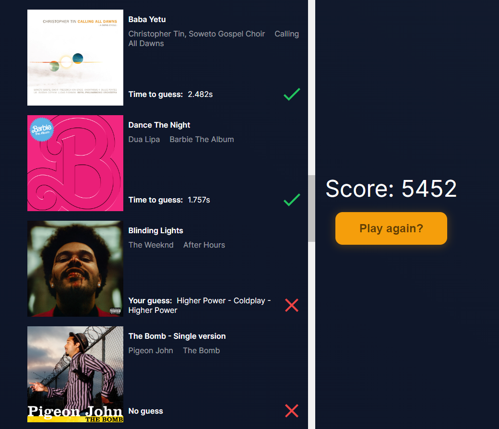
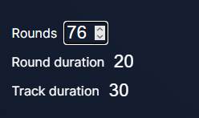
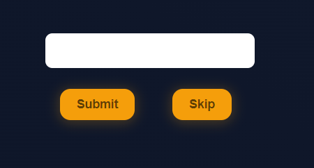

# Changelog

## Unreleased

## Category sets can space out repeats

A category set can now carry **minimum distances** (`work — min 5 rounds`), defined in the set's own
card under its value limits. In a category game the round no longer plays the first track waiting in
the category: it plays the first one that is at least that many rounds away from the last track
sharing the same field value, so two openings from the same anime cannot land back to back. Every
value of a multi-valued tag counts, and the comparison ignores case. The smallest distance you can
set is 2 — "not back to back" — because two tracks are never closer than one round apart, so 1 would
be a rule that blocks nothing.

The cost is that the rule can run out of room. When nothing in the chosen category satisfies it, the
round still plays — it takes the track that breaks the rule by the smallest margin rather than
stalling, so a nearly exhausted category degrades instead of blocking. Playing a track by its number
(the host's escape hatch) ignores the rule entirely, though the forced track still occupies a round
that later rounds measure their distance against. Category counters are unchanged: they still say
how many tracks are left in a category, not how many are playable right now.

Distances apply **only** in category mode — random mode has no set to carry them — and they are
frozen when the game starts, so editing the set mid-game does not change the running match. Category
set JSON export/import carries `minDistances` inline; sets exported before this release import
unchanged, as sets without distances. Importing a file over a set you already have replaces both its
value limits and its distances with what the file says — a set is imported as the file's whole
configuration, never as a mix of the file's proportions and the spacing you had before.

## Category sets can cap repeated values

A category set can now carry **value limits** (`work — self max 3`, `└ grouping max 1`, …), defined
in the set's own card next to its categories. Before a category game starts, the pool is trimmed so
no field value — and no pair of field values — repeats past its configured limit; a "Madoka Magica"
tag can no longer supply four openings in one game just because the library has four. Limits are
duplicated per set on purpose (decision: the set is the unit that versions together, in the UI and
in the exported JSON), and they apply **only** in category mode — random mode has no set to carry
them.

Setup shows the effect as a single number, `N → M tracks after value limits`, next to "Rounds", plus
a one-line `Trims the pool: work ≤3, grouping ≤1` caption on the category-set picker and a warning
when the trimmed pool can no longer fill the planned number of rounds. The coverage report's counts
are now computed **after** this trim, not before.

Category set JSON export/import carries `valueLimitations` inline. Sets exported before this release
import unchanged, as sets without limits. `exceptions` (per-value overrides) are validated, stored,
and round-tripped through the editor and the file, but the engine does not act on them yet — they
are a v5.x extension point.

## Categories are metadata predicates

A category is no longer a list of library tags. It is now a condition on track metadata — Navidrome
tags plus the fields you add in the overlay — built in the editor as rows of `field / operator /
value`, joined with **match all** or **match any**. Operators: `is`, `is not`, `contains`,
`greater than`, `less than`, `in range`, `is missing`, `is present`. Text comparisons ignore case,
so a category defined as `grouping is op` also catches tracks tagged `OP`.

Field names and their values are suggested from Navidrome, and the new **Manage fields** dialog in
the Navidrome library names and types the overlay fields (text or number) a category can match on.

**Categories stored before this release are deleted when the database upgrades.** Old `tagFilter`
values held tags of the old Harmonify library, not Navidrome field names, so there was nothing to
convert them from — categories have to be recreated (or imported). Named category sets survive,
empty. Saved game results are untouched; an unfinished category game started before the upgrade
will not find its categories any more.

## Categories and category sets are exchanged as JSON

Export and import of categories **and of category sets** moved from CSV to JSON — a predicate is a
nested structure and a set is an ordered list, which a flat table cannot express. **Old CSV files
of these two entities no longer import.** The track overlay stays CSV.

- Categories import as an upsert keyed by the display name: a category already in the library is
  overwritten with what the file says, so re-importing an older file reverts edits made in the UI.
- In a set file, membership order is the array order — the `order` column is gone. A set naming a
  category the library does not have is reported; an existing set is then left untouched rather
  than emptied.
- A single broken entry is reported with its index and the rest of the file still imports.

## Track counts moved to the coverage report

`/library/categories` no longer shows how many tracks each category holds — the number depended on
the old library, and Navidrome's tag API carries no counts. The count now appears in the game setup
after a playlist or album is picked, together with how many tracks fall into no category and how
many into several.

## v3.2.0 (2024-06-22)

## UI improvements

Done many quality of life changes in setup view, some of the most notable:
- New game settings form displays units and how many tracks are selected
- Loading playlists and albums is now non blocking, game settings form can be edited while waiting
- Changed player nickname form to better display errors and allow users to fix them
- Nicknames are now saved locally and loaded after joining room (if they are not conflicting with existing players)

## Better round results

Round results now show other players guesses if they sent an incorrect one and special icon for disconnected players

## Other players game results

On results page users can now check in detail how game went for other players

## Play again

Clicking "Play Again" now works as expected, another game can be started in the same room and players keep connection. It works only if host doesn't disconnect, otherwise new room must be created.

**Full Changelog**: https://github.com/kaczkadevteam/harmonify/compare/v3.1.0...v3.2.0

## v3.1.0 (2024-06-13)

## Mobile

Game now supports mobile, tablet and small desktops UI. This change brings also many quality of life and bugfixes to original UI.

## Pause

Room host can now pause game, no more missing tracks for person going AFK

## Quitting

Players can now quit game properly which removes them from leaderboard for other players. If left in the middle of the game it displays results so far for leaving player

## Autoplay

Add setting to change how autoplay behaves during round, possible options are: always, once and never.

---

**Full Changelog**: https://github.com/kaczkadevteam/harmonify/compare/v3.0.0...v3.1.0

## v3.0.0 (2024-05-29)

## Multiplayer

Game now supports multiplayer gameplay! To achieve this we developed [API service](https://github.com/kaczkadevteam/harmonify-api) and changed most of app logic.

## Music player

App no longer uses Spotify Web Playback SDK (player in browser) to play music, now its based on 30 second MP3 previews. **Thanks to this, a premium account is no longer required to create a room, and room guests don't have to connect to Spotify at all.**

## New Contributors
* @FilipTarajko made their first contribution in https://github.com/kaczkadevteam/harmonify/pull/17

## v2.0.0 (2024-04-18)

## Migration

Migrate from Next.js to Vue, refactor code to be more clear, improve UI a little

## v1.1.0 (2024-03-21)

## Game results

Now, after the game, the user is given list of tracks that were in the game, along with results: whether they guessed correctly, the time it took, or if they did not guess correctly, what mistake they made.

## Round settings

Before the game starts, now you can adjust settings like number of rounds, round duration and track duration.

## Skip button

Previously there was no way to jump to another track without giving a guess, but no more: welcome the skip button!

## v1.0.0 (2024-02-01)

## What's changed

-   ✨ Finish all milestones required before v1.0.0 release

## Achieved milestones

-   Core features
-   Code Refactorization
-   Polish UI
-   Quality of life
